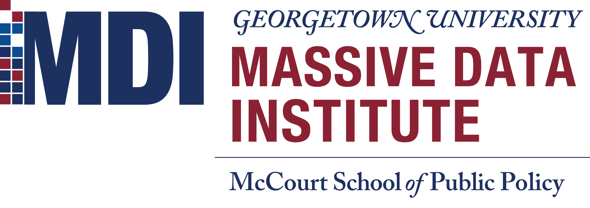

[](https://mybinder.org/v2/gh/jhaber-zz/text-classify-2021/HEAD)

# Text classification: A Practical Introduction in Python
## A workshop with the [Massive Data Institute](https://mccourt.georgetown.edu/research/the-massive-data-institute/), Georgetown University


## Overview

One of the most common tasks in natural language processing (NLP) is classifying texts into categories: which emails are spam, which tweets are happy, etc. This method is called _text classification_ and involves building algorithms to predict text labels. This workshop will give you hands-on experience with a typical text classification workflow, including text featurization, supervised machine learning, and model evaluation. Basic familiarity with Python is required, but no prior experience with NLP is needed.


## Workshop goals

* TBD


## Prerequisites

We will get our hands dirty implementing an assortment of simple web-crawling tools. To follow along with the code—which is the point—will need some familiarity with Python and Jupyter Notebooks. If you haven't programmed in Python or haven’t used Jupyter Notebooks, please do some self-teaching before this workshop using resources like those listed below. 


## Getting started & software prerequisites

For simplicity, just click the "Launch Binder" button (at the top of this Readme) to create a virtual environment ready for this workshop. It may take a few minutes; if it takes longer than 10, try again.

If you want to run the code on your computer, you have two options. You could use [Anaconda](https://www.anaconda.com/what-is-anaconda/) to make installation easy: [download Anaconda](https://www.anaconda.com/download/) . Or if you already have Python 3.x installed with the full list of libraries listed under `requirements.txt`, you're welcome to clone this repository and follow along on your own machine. You can also install all the necessary packages like so: 

```
pip3 install -r requirements.txt
```


## About the presenter

[Dr. Jaren Haber](https://www.jarenhaber.com/) is a Postdoctoral Fellow with Georgetown University’s Massive Data Institute. His research applies computational methods to study how organizational contexts, social categories, and media segmentation shape the impacts of structural inequalities. He also leads the GU Interdisciplinary Text Analysis Research (GUITAR) working group. Dr. Haber received his PhD in Sociology from the University of California, Berkeley in 2020.


## Open-access, online resources

### Python and Jupyter notebooks

* [Introduction to Jupyter Notebooks (Real Python)](https://realpython.com/jupyter-notebook-introduction/)
* [Quick Python intro (a Jupyter Notebook)](https://github.com/jhaber-zz/nlp-python-2020/blob/master/solutions/intro-to-python.ipynb)
* [Great book on Python (with exercises): “Python for Everybody” (Charles Severance)](https://www.py4e.com/book.php)
* [Official Python Tutorial](https://docs.python.org/3/tutorial/index.html)
* [Python tutorials for social scientists (Neal Caren)](https://nealcaren.github.io/python-tutorials/)

### NLP in Python

* [NLP course & scripts, for social scientists & digital humanists (Laura Nelson)](https://github.com/lknelson/text-analysis-course)
* [NLP textbook (Jurafsky & Martin @ Stanford)](https://web.stanford.edu/~jurafsky/slp3/)
* [Book on NLTK (NLTK team)](http://www.nltk.org/book/)
* [Datasets for NLP (Hugging Face)](https://github.com/huggingface/datasets)
* [Intro to SpaCy and NLP concepts (Allison Parrish)](https://gist.github.com/aparrish/f21f6abbf2367e8eb23438558207e1c3)
* [Workshops on NLTK and SpaCy (Geoff Bacon @ D-Lab)](https://github.com/geoffbacon/nlp-with-nltk-spacy)


## O'Reilly books related to text classification
These are available free to Georgetown students/affiliates ([log in here then search for books](https://www.safaribooksonline.com/library/view/temporary-access/))

* [Popular intro book: _Automate the Boring Stuff with Python_](https://nostarch.com/automatestuff2)
* (More coming)


## Contributing

If you spot a problem with these materials, please make an issue describing the problem or contact Jaren at jhaber@berkeley.edu. If you want to suggest additional resources or materials, please branch and make a pull request!


## Acknowledgments

* [Summer Institute in Computational Social Science](https://sicss.io/)
* [D-Lab at the University of California, Berkeley](https://dlab.berkeley.edu/), especially their [Machine learning in Python workshop](https://github.com/dlab-berkeley/python-machine-learning)
* [Geoff Bacon](https://geoffbacon.github.io/), especially his [Introduction to text classification workshop](https://github.com/TextXD/introduction-to-text-classification)


<br>


